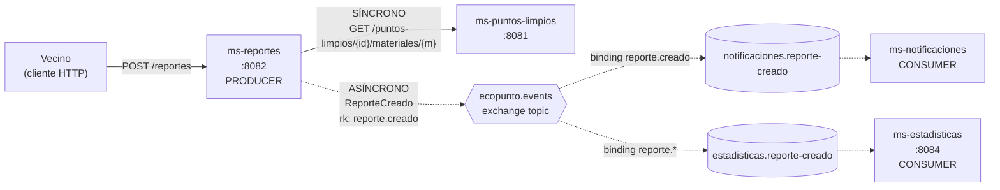
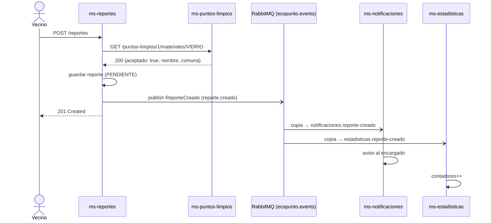
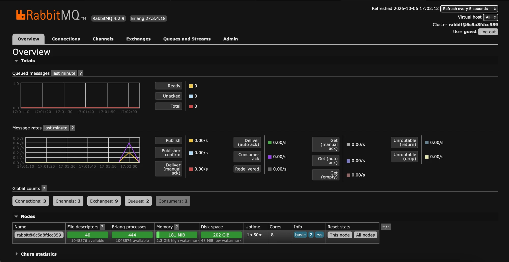
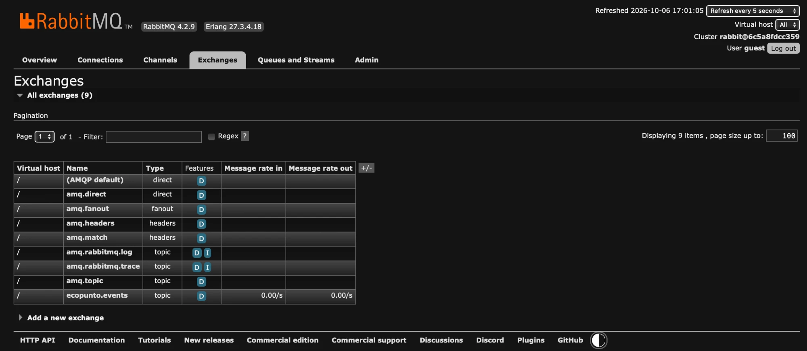
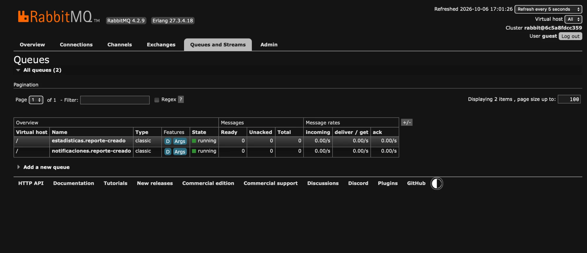
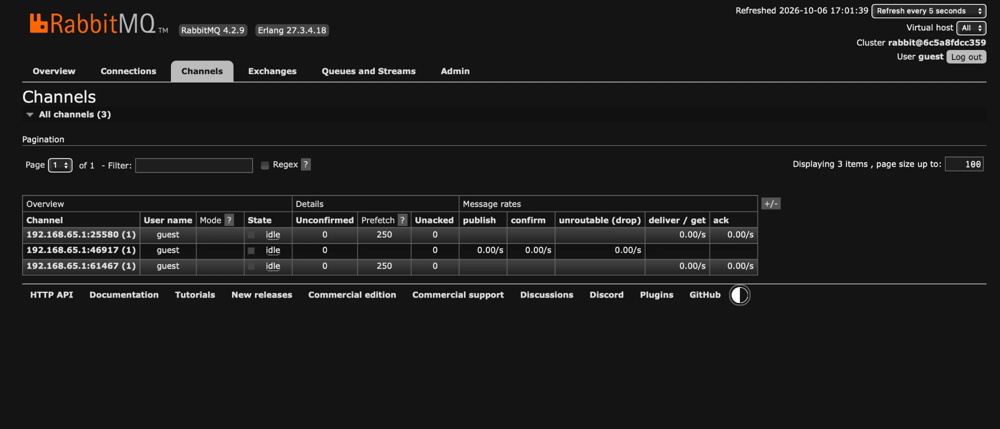

# Actividad evaluada · Comunicación síncrona y asíncrona con RabbitMQ

**Asignatura:** DSY1107 · Desarrollo Cloud Native I · Sección 002D  
**Estudiante:** Jonathan Larraguibel  
**Actividad:** Semana 08 · 10% de la Evaluación Parcial 2  
**Caso:** EcoPunto · reporte de materiales que un punto limpio dejó de recibir  
**Modalidad:** individual · informe sin presentación  
**Versión PDF:** [`informe-actividad-rabbitmq.pdf`](informe-actividad-rabbitmq.pdf)

---

## Parte 1 · Diseño

### 1. Problema y contexto

EcoPunto es un sistema para consultar puntos limpios de reciclaje. Los vecinos pueden **reportar que un punto dejó de recibir un material**; por ejemplo, "el Punto Limpio Ñuñoa ya no recibe vidrio porque retiraron el contenedor".

Cuando se registra un reporte ocurren varias cosas:

1. Hay que **validar** que el punto existe y que efectivamente recibía ese material. No tiene sentido reportar que un punto "dejó de recibir papel" si nunca lo recibió.
2. Hay que **registrar** el reporte.
3. Hay que **avisar al encargado** del punto para que revise la situación.
4. Hay que **actualizar estadísticas** (reportes por comuna y por material) para detectar zonas problemáticas.

La pregunta de diseño es:

> ¿Qué necesita ocurrir inmediatamente para continuar el flujo y qué puede ocurrir después sin bloquear al vecino?

Los pasos 1 y 2 son necesarios para responderle al vecino si su reporte fue aceptado. Los pasos 3 y 4 son **consecuencias** del reporte: al vecino no le cambia nada si el aviso al encargado tarda unos segundos, y no debería recibir un error porque el servicio de estadísticas esté caído.

### 2. Microservicios y responsabilidades

| Microservicio | Puerto | Responsabilidad | Rol en mensajería |
|---|---|---|---|
| `ms-puntos-limpios` | 8081 | Dueño de los puntos limpios y sus materiales aceptados. Responde si un punto acepta un material. | — |
| `ms-reportes` | 8082 | Recibe y registra reportes. Orquesta la validación. | **Producer** |
| `ms-notificaciones` | 8083* | Avisa al encargado del punto (correo simulado con log). | **Consumer** |
| `ms-estadisticas` | 8084 | Cuenta reportes por comuna y material; expone `GET /estadisticas`. | **Consumer** |
| RabbitMQ | 5672 / 15672 | Broker de mensajería y Management UI. | Broker |

\* `ms-notificaciones` no expone HTTP: solo escucha su cola.

### 3. Flujo principal

```text
Vecino (cliente HTTP)
   │ 1. POST /reportes {puntoLimpioId, material, descripcion, autorEmail}
   ▼
ms-reportes
   │ 2. SÍNCRONO: GET /puntos-limpios/{id}/materiales/{material} ──> ms-puntos-limpios
   │              ◄── {nombre, comuna, aceptado: true|false}   (o 404)
   │
   │ 3. Si el punto no existe → 404.  Si el material no era aceptado → 422.  (no se publica nada)
   │ 4. Registra el reporte (estado PENDIENTE)
   │ 5. ASÍNCRONO: publica ReporteCreado en el exchange ecopunto.events (routing key reporte.creado)
   │ 6. Responde 201 Created al vecino   ← no espera a los consumers
   ▼
RabbitMQ ── exchange topic ecopunto.events
   ├── binding reporte.creado ──> cola notificaciones.reporte-creado ──> ms-notificaciones (aviso al encargado)
   └── binding reporte.*      ──> cola estadisticas.reporte-creado   ──> ms-estadisticas  (contadores)
```

### 4. Comunicación síncrona

| Origen → Destino | Protocolo | Operación |
|---|---|---|
| `ms-reportes` → `ms-puntos-limpios` | HTTP/REST (`RestClient`) | `GET /puntos-limpios/{id}/materiales/{material}` |

### 5. Comunicaciones asíncronas

| # | Evento | Producer | Consumer | Efecto |
|---|---|---|---|---|
| A1 | `ReporteCreado` | `ms-reportes` | `ms-notificaciones` | Aviso al encargado del punto |
| A2 | `ReporteCreado` | `ms-reportes` | `ms-estadisticas` | Actualizar contadores por comuna y material |

Ambas comunicaciones nacen del **mismo evento** publicado una sola vez: el exchange entrega una copia a cada cola suscrita (Publish/Subscribe).

### 6. Justificación de cada decisión

| Comunicación | Tipo | Justificación |
|---|---|---|
| Validar punto y material | **Síncrona** | Es una **precondición**: sin la respuesta no se puede decidir si el reporte se acepta (201) o se rechaza (404/422). El vecino necesita esa respuesta en el momento. Si se hiciera asíncrona, el sistema aceptaría reportes inválidos y tendría que "deshacerlos" después. |
| Aviso al encargado (A1) | **Asíncrona** | Es una **consecuencia**: el vecino no necesita esperar el correo para saber que su reporte quedó registrado. Si el servicio de notificaciones o el correo fallan, el reporte no debe fallar; el aviso queda en la cola hasta que el servicio vuelva. |
| Estadísticas (A2) | **Asíncrona** | Los contadores pueden actualizarse segundos después sin efecto en el usuario. Además, si mañana aparecen más interesados en el mismo evento (auditoría, analítica), se suscriben sin modificar `ms-reportes`. |

**Lo que deliberadamente NO pasa por RabbitMQ:**

- Consultar el listado de puntos limpios (`GET /puntos-limpios`): es una lectura que necesita respuesta inmediata.
- Guardar el reporte dentro de `ms-reportes`: es la operación principal; si falla, el vecino debe saberlo.
- Responder la validación: usar una cola para una pregunta que necesita respuesta inmediata (RPC sobre colas) agregaría complejidad sin beneficio.

### 7. Eventos que circulan por RabbitMQ

| Evento | Significado | Cuándo se publica |
|---|---|---|
| `ReporteCreado` | "Se registró un reporte válido sobre un punto limpio" | Después de guardar el reporte, nunca antes de validar |

Se nombra en **pasado** porque informa algo que ya ocurrió; no es una orden ("EnviarCorreo") dirigida a un servicio específico. Así el producer no sabe quién lo consume.

### 8. Producer

`ms-reportes`, a través de `RabbitReporteEventPublisher`, que implementa el puerto de dominio `ReporteEventPublisher`.

### 9. Consumers

| Consumer | Cola | Qué hace |
|---|---|---|
| `ms-notificaciones` | `notificaciones.reporte-creado` | Arma y "envía" el aviso al encargado del punto (log `[NOTIFICACION]`) |
| `ms-estadisticas` | `estadisticas.reporte-creado` | Incrementa contadores (log `[ESTADISTICAS]`, `GET /estadisticas`) |

### 10. Exchange, queues, routing keys y bindings

| Elemento | Nombre | Tipo / valor | Durable | Declarado por |
|---|---|---|---|---|
| Exchange | `ecopunto.events` | `topic` | Sí | Producer y consumers (declaración idempotente) |
| Routing key | `reporte.creado` | — | — | La usa el producer al publicar |
| Queue | `notificaciones.reporte-creado` | classic | Sí | `ms-notificaciones` |
| Binding | `ecopunto.events` → `notificaciones.reporte-creado` | `reporte.creado` | — | `ms-notificaciones` |
| Queue | `estadisticas.reporte-creado` | classic | Sí | `ms-estadisticas` |
| Binding | `ecopunto.events` → `estadisticas.reporte-creado` | `reporte.*` | — | `ms-estadisticas` |

**Decisiones de topología:**

- **Exchange `topic` y no `direct`.** Con `direct` habría que enumerar cada routing key. Con `topic`, `ms-estadisticas` se suscribe a `reporte.*` y recibirá automáticamente futuros eventos como `reporte.resuelto`, mientras `ms-notificaciones` sigue recibiendo solo `reporte.creado`. El producer no cambia.
- **Una cola por consumer.** Si ambos servicios leyeran la misma cola, RabbitMQ repartiría los mensajes entre ellos (round-robin) y cada evento lo procesaría solo uno. Con colas separadas cada servicio recibe **su propia copia**.
- **Cada consumer declara su cola y su binding.** El producer solo conoce el exchange. Agregar un consumer nuevo no requiere tocar `ms-reportes`.
- **Exchange y colas durables, mensajes persistentes.** Sobreviven a un reinicio del broker. Es la base para la Semana 09 (ACK manual y DLQ).
- **Nombres de cola `<consumer>.<evento>`.** En el Management UI se identifica de inmediato a quién pertenece cada cola y qué escucha.

### 11. Payload mínimo

```json
{
  "eventId": "598a1aad-0d83-4a73-bcdb-7d7cd6dec071",
  "tipo": "ReporteCreado",
  "ocurridoEn": "2026-10-06T16:04:41.508Z",
  "reporteId": 1,
  "puntoLimpioId": 1,
  "puntoNombre": "Punto Limpio Ñuñoa",
  "comuna": "Ñuñoa",
  "material": "VIDRIO",
  "descripcion": "El contenedor de vidrio fue retirado",
  "autorEmail": "vecino@ejemplo.cl"
}
```

| Campo | Para qué |
|---|---|
| `eventId` | Identificar el evento de forma única (trazabilidad; base para idempotencia futura) |
| `tipo`, `ocurridoEn` | Saber qué pasó y cuándo |
| `reporteId`, `puntoLimpioId` | Referencias a las entidades |
| `puntoNombre`, `comuna` | **Datos enriquecidos**: los consumers no necesitan llamar a `ms-puntos-limpios`, lo que evita volver a acoplarlos de forma síncrona |
| `material`, `descripcion`, `autorEmail` | Contenido del reporte para el aviso y las estadísticas |

Formato: JSON (`content_type: application/json`), mensaje persistente (`delivery_mode: 2`).

### 12. Diagramas

**Arquitectura**



**Secuencia de un reporte válido**



---

## Parte 2 · Implementación

### 13. Tecnologías

- Java 21, Spring Boot 4.1.1, Spring AMQP (`spring-boot-starter-amqp`), Spring Web MVC.
- RabbitMQ 4.2 con Management plugin, en Docker Compose.
- Mensajes JSON con `JacksonJsonMessageConverter`.
- Datos en memoria: el foco de la actividad es la comunicación, no la persistencia.

### 14. Estructura

```text
evaluaciones/ev2-actividad-rabbitmq/
├── README.md                      ← este informe
├── docker-compose.yml             ← RabbitMQ 4.2 + management
├── docs/capturas/                 ← evidencia del Management UI
├── ms-puntos-limpios/             ← :8081  validación (destino síncrono)
│   └── .../puntoslimpios/
│       ├── PuntoLimpio.java
│       ├── PuntoLimpioRepository.java
│       └── PuntoLimpioController.java
├── ms-reportes/                   ← :8082  PRODUCER
│   └── .../reportes/
│       ├── web/ReporteController.java            ← HTTP + códigos 201/404/422/503
│       ├── dominio/ReporteService.java           ← lógica: validar → guardar → publicar
│       ├── dominio/ReporteEventPublisher.java    ← puerto (interfaz), sin RabbitMQ
│       ├── dominio/ReporteCreadoEvent.java
│       ├── cliente/PuntosLimpiosClient.java      ← comunicación síncrona (RestClient)
│       └── mensajeria/
│           ├── RabbitMQConfig.java               ← exchange + converter JSON
│           └── RabbitReporteEventPublisher.java  ← implementación con RabbitTemplate
├── ms-notificaciones/             ← CONSUMER
│   └── .../notificaciones/
│       ├── NotificacionService.java              ← lógica del aviso
│       └── mensajeria/
│           ├── RabbitMQConfig.java               ← cola + binding reporte.creado
│           └── ReporteCreadoListener.java        ← @RabbitListener
└── ms-estadisticas/               ← CONSUMER
    └── .../estadisticas/
        ├── EstadisticasService.java              ← lógica de contadores
        ├── EstadisticasController.java           ← GET /estadisticas
        └── mensajeria/
            ├── RabbitMQConfig.java               ← cola + binding reporte.*
            └── ReporteCreadoListener.java        ← @RabbitListener
```

### 15. Separación entre infraestructura de mensajería y lógica de aplicación

En los cuatro servicios, todo lo que conoce RabbitMQ vive en el paquete `mensajeria`. La lógica de negocio no importa ninguna clase de Spring AMQP.

**Producer.** `ReporteService` depende de una interfaz; no sabe que existe RabbitMQ:

```java
// dominio/ReporteEventPublisher.java
public interface ReporteEventPublisher {
    void publicar(ReporteCreadoEvent event);
}

// dominio/ReporteService.java
public Reporte crear(Long puntoLimpioId, String material, String descripcion, String autorEmail) {
    // 1. Comunicación síncrona: sin esta respuesta no se puede decidir si el reporte es válido.
    ValidacionMaterial validacion = puntosLimpiosClient.validarMaterial(puntoLimpioId, material);
    if (!validacion.aceptado()) {
        throw new ReporteInvalidoException(...);          // → 422, no se publica nada
    }
    // 2. Procesamiento principal: registrar el reporte.
    Reporte reporte = repository.guardar(...);
    // 3. Comunicación asíncrona: informar que ocurrió, sin esperar a los interesados.
    eventPublisher.publicar(ReporteCreadoEvent.desde(reporte, validacion.nombre(), validacion.comuna()));
    return reporte;
}
```

La implementación concreta está en `mensajeria`:

```java
// mensajeria/RabbitReporteEventPublisher.java
@Override
public void publicar(ReporteCreadoEvent event) {
    rabbitTemplate.convertAndSend(RabbitMQConfig.EXCHANGE, RabbitMQConfig.RK_REPORTE_CREADO, event);
}
```

Si mañana RabbitMQ se reemplazara por otro broker (por ejemplo Amazon SNS/SQS), solo cambiaría esta clase y su configuración.

**Consumers.** El `@RabbitListener` solo traduce el mensaje y delega en un servicio de negocio:

```java
// ms-notificaciones · mensajeria/ReporteCreadoListener.java
@RabbitListener(queues = RabbitMQConfig.QUEUE)
public void onReporteCreado(ReporteCreadoEvent event) {
    notificacionService.notificarEncargado(event);
}
```

**Topología centralizada.** Cada servicio la declara en una única clase `RabbitMQConfig`:

```java
// ms-estadisticas · mensajeria/RabbitMQConfig.java
@Bean
public TopicExchange ecopuntoEventsExchange() {
    return new TopicExchange("ecopunto.events", true, false);           // durable
}
@Bean
public Queue estadisticasQueue() {
    return QueueBuilder.durable("estadisticas.reporte-creado").build();
}
@Bean
public Binding estadisticasBinding(Queue estadisticasQueue, TopicExchange ecopuntoEventsExchange) {
    return BindingBuilder.bind(estadisticasQueue).to(ecopuntoEventsExchange).with("reporte.*");
}
```

**Contrato del evento.** Cada servicio tiene su propia copia del record `ReporteCreadoEvent`. Lo compartido entre servicios es el **JSON**, no una librería de código: así cada uno puede evolucionar y desplegarse por separado.

### 16. Cómo ejecutar

```bash
# 1. RabbitMQ (desde evaluaciones/ev2-actividad-rabbitmq)
docker compose up -d

# 2. Compilar los 4 servicios
for s in ms-puntos-limpios ms-reportes ms-notificaciones ms-estadisticas; do (cd $s && mvn clean package); done

# 3. Levantar cada servicio en una terminal distinta
java -jar ms-puntos-limpios/target/ms-puntos-limpios-0.0.1-SNAPSHOT.jar
java -jar ms-reportes/target/ms-reportes-0.0.1-SNAPSHOT.jar
java -jar ms-notificaciones/target/ms-notificaciones-0.0.1-SNAPSHOT.jar
java -jar ms-estadisticas/target/ms-estadisticas-0.0.1-SNAPSHOT.jar

# 4. Crear un reporte
curl -X POST http://localhost:8082/reportes -H "Content-Type: application/json" \
  -d '{"puntoLimpioId":1,"material":"VIDRIO","descripcion":"El contenedor de vidrio fue retirado","autorEmail":"vecino@ejemplo.cl"}'

# 5. Ver estadísticas
curl http://localhost:8084/estadisticas
```

Management UI: <http://localhost:15672> (`guest` / `guest`).

---

## Evidencia

Pruebas ejecutadas el 2026-10-06 en macOS con Docker Desktop. Las salidas son reales; en los logs se omitió el prefijo de Spring (PID, hilo, clase) para facilitar la lectura.

### 17. Topología creada en RabbitMQ

Al arrancar, cada servicio declaró su parte de la topología:

```text
$ docker exec ecopunto-rabbitmq rabbitmqctl list_exchanges name type durable
ecopunto.events                 topic   true

$ docker exec ecopunto-rabbitmq rabbitmqctl list_bindings source_name destination_name routing_key
ecopunto.events   notificaciones.reporte-creado   reporte.creado
ecopunto.events   estadisticas.reporte-creado     reporte.*

$ docker exec ecopunto-rabbitmq rabbitmqctl list_queues name durable messages consumers
notificaciones.reporte-creado   true   0   1
estadisticas.reporte-creado     true   0   1
```

### 18. Recorrido completo de una operación

Reporte: *"el Punto Limpio Ñuñoa ya no recibe VIDRIO"*.

**Solicitud**

```text
$ curl -X POST http://localhost:8082/reportes -H "Content-Type: application/json" \
    -d '{"puntoLimpioId":1,"material":"VIDRIO","descripcion":"El contenedor de vidrio fue retirado","autorEmail":"vecino@ejemplo.cl"}'

HTTP 201
{"id":1,"puntoLimpioId":1,"material":"VIDRIO","descripcion":"El contenedor de vidrio fue retirado",
 "autorEmail":"vecino@ejemplo.cl","estado":"PENDIENTE","creadoEn":"2026-10-06T16:04:41.438779Z"}
```

**Logs de los cuatro servicios, en orden cronológico**

```text
13:04:41.254  ms-reportes        [SYNC] GET /puntos-limpios/1/materiales/VIDRIO -> ms-puntos-limpios
13:04:41.376  ms-puntos-limpios  [VALIDACION] punto=1 material=VIDRIO aceptado=true
13:04:41.437  ms-reportes        [SYNC] respuesta: ValidacionMaterial[puntoLimpioId=1, nombre=Punto Limpio Ñuñoa, comuna=Ñuñoa, material=VIDRIO, aceptado=true]
13:04:41.439  ms-reportes        [REPORTE] registrado id=1 punto=1 material=VIDRIO
13:04:41.508  ms-reportes        [ASYNC] publicado ReporteCreado eventId=598a1aad-… -> exchange=ecopunto.events routingKey=reporte.creado
13:04:41.666  ms-notificaciones  [CONSUMER] ReporteCreado recibido desde cola notificaciones.reporte-creado eventId=598a1aad-…
13:04:41.666  ms-notificaciones  [NOTIFICACION] Para: encargado de "Punto Limpio Ñuñoa" (Ñuñoa) | Asunto: nuevo reporte #1 |
                                 El material VIDRIO ya no se estaría recibiendo. Detalle: "El contenedor de vidrio fue retirado" (reportado por vecino@ejemplo.cl)
13:04:41.679  ms-estadisticas    [CONSUMER] ReporteCreado recibido desde cola estadisticas.reporte-creado eventId=598a1aad-…
13:04:41.680  ms-estadisticas    [ESTADISTICAS] total=1 | Ñuñoa=1 | VIDRIO=1
```

| Etapa | Evidencia |
|---|---|
| Solicitud | `POST /reportes` → `201` |
| Procesamiento principal | `[REPORTE] registrado id=1` |
| Comunicación síncrona | `[SYNC]` en ms-reportes ↔ `[VALIDACION]` en ms-puntos-limpios |
| Publicación del evento | `[ASYNC] publicado ReporteCreado … routingKey=reporte.creado` |
| Exchange y routing | `ecopunto.events` (topic) entrega por `reporte.creado` y por `reporte.*` |
| Queue | Cada consumer lo recibe desde **su** cola |
| Consumer y procesamiento asíncrono | `[NOTIFICACION]` y `[ESTADISTICAS]` con el **mismo** `eventId` |

El mismo `eventId` en los dos consumers demuestra que **un solo** publish generó **dos copias**, una por cola.

### 19. Casos en que la comunicación síncrona corta el flujo

| Caso | Solicitud | Respuesta | ¿Se publicó evento? |
|---|---|---|---|
| Material que el punto nunca aceptó | Providencia + `PAPEL` | `422` · *"El punto Punto Limpio Providencia no recibe PAPEL: no se puede reportar que dejó de recibirlo"* | **No** |
| Punto inexistente | punto `99` | `404` · *"No existe el punto limpio 99"* | **No** |
| Reporte válido | Providencia + `PILAS` | `201` | Sí |

```text
13:04:41.554  ms-reportes        [SYNC] GET /puntos-limpios/2/materiales/PAPEL -> ms-puntos-limpios
13:04:41.567  ms-puntos-limpios  [VALIDACION] punto=2 material=PAPEL aceptado=false
13:04:41.592  ms-reportes        [SYNC] respuesta: ValidacionMaterial[..., material=PAPEL, aceptado=false]
              (sin [REPORTE] ni [ASYNC]: el flujo se detiene)
13:04:41.631  ms-reportes        [SYNC] GET /puntos-limpios/99/materiales/VIDRIO -> ms-puntos-limpios
13:04:41.636  ms-puntos-limpios  [VALIDACION] punto=99 no existe
```

Esto justifica que la validación sea síncrona: el resultado **cambia la respuesta al usuario** y evita publicar eventos de reportes inválidos.

### 20. Resultado observable: estadísticas

```text
$ curl http://localhost:8084/estadisticas
{"totalReportes":3,"porComuna":{"Providencia":1,"Ñuñoa":2},"porMaterial":{"PILAS":1,"PLASTICO":1,"VIDRIO":1}}
```

Tres reportes válidos (VIDRIO y PLASTICO en Ñuñoa, PILAS en Providencia). Los dos rechazados (422 y 404) no aparecen, porque nunca generaron evento.

### 21. Prueba A · Consumer caído: el mensaje espera en la cola

Se detuvo `ms-notificaciones` y se creó un reporte.

```text
# Con ms-notificaciones detenido: su cola queda sin consumidor
notificaciones.reporte-creado   0   0
estadisticas.reporte-creado     0   1

$ curl -X POST http://localhost:8082/reportes ... '{"puntoLimpioId":1,"material":"PLASTICO",...}'
HTTP 201 en 0.030s                       ← el vecino no se ve afectado

notificaciones.reporte-creado   1   0    ← el aviso queda esperando
estadisticas.reporte-creado     0   1    ← estadísticas lo procesó normalmente
```

El mensaje en la cola, inspeccionado con la API del Management UI sin consumirlo:

```text
routing_key: reporte.creado | exchange: ecopunto.events | delivery_mode: 2 | content_type: application/json
payload: {"eventId":"a63899a1-1f70-418a-8f0a-081b7ee853ac","tipo":"ReporteCreado","ocurridoEn":"2026-10-06T16:05:01.564967Z",
          "reporteId":3,"puntoLimpioId":1,"puntoNombre":"Punto Limpio Ñuñoa","comuna":"Ñuñoa","material":"PLASTICO",
          "descripcion":"Contenedor de plástico rebalsado y cerrado","autorEmail":"vecino@ejemplo.cl"}
```

`delivery_mode: 2` confirma que el mensaje es **persistente**.

Al levantar `ms-notificaciones` de nuevo:

```text
13:05:04.263  ms-notificaciones  Started MsNotificacionesApplication in 0.794 seconds
13:05:04.290  ms-notificaciones  [CONSUMER] ReporteCreado recibido desde cola notificaciones.reporte-creado eventId=a63899a1-…
13:05:04.290  ms-notificaciones  [NOTIFICACION] Para: encargado de "Punto Limpio Ñuñoa" (Ñuñoa) | Asunto: nuevo reporte #3 | ...

notificaciones.reporte-creado   0   1    ← entregado y confirmado
```

**Conclusión:** la caída de un consumer **no afecta** al usuario ni a los demás consumers, y no se pierde el aviso. Es exactamente lo que justificó hacer esta comunicación asíncrona.

### 22. Prueba B · Dependencia síncrona caída

Se detuvo `ms-puntos-limpios` y se intentó crear un reporte:

```text
$ curl -X POST http://localhost:8082/reportes ...
HTTP 503 en 0.029s
{"detail":"ms-puntos-limpios no está disponible","instance":"/reportes","status":503,"title":"Service Unavailable"}

notificaciones.reporte-creado   0   1    ← no se publicó nada
estadisticas.reporte-creado     0   1
reportes registrados: 3                  ← no se guardó un reporte sin validar
```

**Conclusión:** este es el costo conocido de la comunicación síncrona: si la dependencia cae, la operación no puede completarse. Se acepta porque la validación es una precondición del negocio, y el sistema falla de forma **controlada** (`503` claro, sin datos a medio registrar ni eventos falsos).

### 23. Capturas del Management UI

Capturas completas de <http://localhost:15672>, tomadas el 2026-10-06 entre las 17:01 y las 17:02, con los cuatro servicios corriendo y después de enviar reportes de prueba.

#### 23.1 Overview



- **Global counts:** 3 conexiones (ms-reportes, ms-notificaciones, ms-estadisticas; ms-puntos-limpios no usa RabbitMQ), 3 canales, 2 colas y **2 consumers**.
- **Message rates:** el pico de las 17:01:58 corresponde a un reporte enviado justo antes de la captura. La línea amarilla (*Publish*) llega a ~0,2/s y la morada (*Consumer ack*) a ~0,4/s: **un publish generó dos entregas confirmadas**, una por cola.
- **Queued messages** en 0: todo lo publicado fue consumido y confirmado.

#### 23.2 Exchanges



- `ecopunto.events`, de tipo **topic** y durable (`D`), es el exchange de la solución. El resto son los exchanges predeclarados por RabbitMQ.
- Los bindings de este exchange (`reporte.creado` y `reporte.*`) se muestran en la sección 17 con `rabbitmqctl list_bindings`.

#### 23.3 Queues and Streams



- `estadisticas.reporte-creado` y `notificaciones.reporte-creado`: tipo `classic`, **durables** (`D`), en estado `running`.
- Ready, Unacked y Total en 0: no hay mensajes pendientes; cada consumer procesó su copia.

#### 23.4 Channels



| Canal | Prefetch | Columnas con tasa | Rol |
|---|---|---|---|
| `192.168.65.1:25580 (1)` | 250 | *deliver / get*, *ack* | Consumer |
| `192.168.65.1:61467 (1)` | 250 | *deliver / get*, *ack* | Consumer |
| `192.168.65.1:46917 (1)` | — | *publish*, *confirm*, *unroutable* | **Producer** (ms-reportes) |

Cada servicio abre **su propia conexión** (puerto de origen distinto) con un canal. Los dos canales con prefetch 250 son los `@RabbitListener` de ms-notificaciones y ms-estadisticas; el canal con *publish* es el `RabbitTemplate` de ms-reportes.

---

## 24. Resultados y conclusiones

- La arquitectura distingue claramente **qué debe ocurrir ahora** (validar y registrar → síncrono) de **qué puede ocurrir después** (avisar y contar → asíncrono).
- Un solo evento `ReporteCreado`, publicado una vez, llega a **dos consumers independientes** gracias a un exchange `topic` con una cola por consumer.
- Las pruebas de falla confirman las decisiones:
  - consumer caído → el usuario recibe `201` igual y el mensaje espera persistido en la cola;
  - dependencia síncrona caída → `503` controlado, sin reportes ni eventos inválidos.
- El producer no conoce a sus consumers: agregar un tercer interesado (por ejemplo, auditoría) solo requiere una cola y un binding nuevos.
- La lógica de negocio no depende de RabbitMQ: la mensajería está aislada en el paquete `mensajeria` de cada servicio.

## 25. Limitaciones y próximos pasos (Semana 09)

Fuera del alcance de esta actividad, según el enunciado:

| Pendiente | Plan |
|---|---|
| ACK manual | Hoy el ACK es automático (Spring confirma si el listener no lanza excepción). En Semana 09: `acknowledge-mode: manual` con ACK/NACK explícito. |
| Mensajes fallidos | Agregar DLX `ecopunto.dlx` y colas `*.dlq` por consumer. Ejemplo: un evento con `autorEmail` inválido no se reencola, va a la DLQ; un error temporal del servidor de correo sí se reintenta. |
| Idempotencia | Usar `eventId` para no procesar dos veces el mismo evento si se reentrega. |
| Persistencia | Los datos están en memoria; en EcoPunto real se usaría la base de datos existente. |
| Seguridad | La autenticación con Entra ID/JWT ya está implementada en EcoPunto (EP1/EP2); aquí se omitió para enfocarse en la comunicación entre servicios. |
