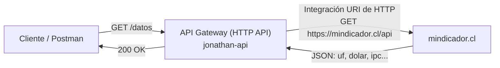

# AWS · Amazon API Gateway real

**Asignatura:** DSY1107 · Desarrollo Cloud Native I · Sección 002D
**Actividades:** 1.1.2 · Creando mi Primer API Manager · 1.1.4 · Configurando CORS en el API Gateway
**Entorno:** AWS Academy Learner Lab (cuenta temporal `voclabs`, Norte de Virginia)

Contraparte real en AWS de lo ya hecho en local en [`labs/api-gateway/`](../api-gateway/) (Semana 01, Spring Cloud Gateway). Mismo concepto — routing, integración, CORS — ejecutado ahora contra un servicio administrado de AWS en vez de un gateway propio.

## 1. Qué se construyó

Una **HTTP API** llamada `jonathan-api` en Amazon API Gateway, con una ruta `GET /datos` integrada contra un backend HTTP público real: [`https://mindicador.cl/api`](https://mindicador.cl/api) (API pública chilena de indicadores económicos — UF, dólar, IPC, etc.).

## 2. Pasos ejecutados (Actividad 1.1.2)

Siguiendo el tutorial institucional *"Creando mi Primer API Manager"*:

| Paso | Acción | Evidencia |
|---|---|---|
| 1 | Crear API HTTP, nombre `jonathan-api` | [`01-configurar-api-http.png`](capturas/01-configurar-api-http.png) |
| 2 | API creada, sin rutas todavía | [`02-api-creada-sin-rutas.png`](capturas/02-api-creada-sin-rutas.png) |
| 3 | Crear ruta `GET /datos` | [`03-ruta-get-datos-creada.png`](capturas/03-ruta-get-datos-creada.png) |
| 4 | Asociar integración: tipo **URI de HTTP**, método `GET`, destino `https://mindicador.cl/api` | [`04-crear-integracion-http-uri.png`](capturas/04-crear-integracion-http-uri.png) |
| 5 | Integración creada y asociada a la ruta (`ID de integración: aid1479`) | [`05-integracion-asociada-detalle.png`](capturas/05-integracion-asociada-detalle.png) |
| 6 | Crear stage `Desarrollo` | [`06-etapa-desarrollo-creada.png`](capturas/06-etapa-desarrollo-creada.png) |
| 7 | Desplegar (`Deploy`) la API al stage `Desarrollo` | [`07-implementacion-desplegada.png`](capturas/07-implementacion-desplegada.png) |
| 8 | Confirmar ARN y las 2 etapas (`$default` y `Desarrollo`) | [`08-detalles-api-arn-etapas.png`](capturas/08-detalles-api-arn-etapas.png) |
| 9 | Probar en Postman: `GET https://y772f4jor1.execute-api.us-east-1.amazonaws.com/Desarrollo/datos` | [`09-postman-test-200-ok.png`](capturas/09-postman-test-200-ok.png) |

**Resultado de la prueba:** `200 OK`, `4.76s`, body con los datos reales de `mindicador.cl` (UF, dólar, etc.).

## 3. CORS (Actividad 1.1.4)

Pantalla de configuración de CORS de la HTTP API, con los métodos habilitados: `GET, POST, OPTIONS, PUT, DELETE` y `Access-Control-Allow-Origin: *` (configuración de **desarrollo**, no de producción — ver nota abajo).

📷 [`10-cors-configuracion.png`](capturas/10-cors-configuracion.png)

> Según la guía 1.1.4: en **producción** este campo debería ser la URL exacta del frontend (`https://tu-dominio.com`), no `*`. Usar `*` solo tiene sentido en desarrollo, donde no existe todavía un frontend real que consumir.

## 4. Del laboratorio conceptual al laboratorio cloud

| Concepto | En local (`labs/api-gateway`, Spring Cloud Gateway) | En AWS (este laboratorio) |
|---|---|---|
| Punto de entrada | `localhost:8080` | `https://y772f4jor1.execute-api.us-east-1.amazonaws.com` |
| Definir una ruta | `predicates: - Path=/api/v1/posts/**` en YAML | Recurso `GET /datos` creado por consola |
| Integración con el backend | `uri: https://jsonplaceholder.typicode.com` + `RewritePath` | Integración tipo **URI de HTTP**, método `GET`, destino `https://mindicador.cl/api` |
| Publicar/activar | La app queda arriba al ejecutar `mvn spring-boot:run` | Requiere crear un **Stage** (`Desarrollo`) y **Deploy** explícito |
| CORS | `globalcors` en `application.yml`, con origen específico | Pantalla dedicada **CORS** en la consola, mismos campos (`Allow-Origin`, `Allow-Methods`, `Allow-Headers`) |
| Identidad del recurso | No aplica (un solo proceso) | **ARN** (`arn:aws:apigateway:us-east-1::/apis/y772f4jor1`) identifica la API dentro de la cuenta AWS |

### Qué cambió

- La "ruta" ya no es una entrada en un YAML que yo escribo — es un recurso administrado por consola/API de AWS, con su propio ID (`y772f4jor1`) y ARN.
- Aparece el concepto de **Stage**: en Spring Cloud Gateway no existe un paso de "despliegue" separado — al levantar la app, ya está sirviendo. En API Gateway, la ruta y la integración pueden existir sin estar publicadas; hace falta un **Deploy** explícito a un stage para que la URL de invocación funcione.
- CORS pasa de ser configuración de código (`globalcors` en YAML) a ser configuración de plataforma, con su propia pantalla dedicada.

### Qué se mantuvo

- El concepto de **route + integration** es idéntico: una condición de entrada (`Path` allá, el recurso `/datos` acá) enlazada a un destino backend.
- CORS sigue resolviendo el mismo problema (Same-Origin Policy del navegador) con los mismos headers (`Access-Control-Allow-Origin`, `-Methods`, `-Headers`).
- El cliente (Postman, o eventualmente un frontend) sigue sin conocer la URL real del backend (`mindicador.cl`) — solo conoce la URL del gateway, exactamente igual que en el laboratorio local.

## 5. Notas de seguridad de esta evidencia

Las capturas muestran el **ID de cuenta de AWS Academy** (`3408-8067-5552`) y el usuario `voclabs`. Es una cuenta de laboratorio temporal (se resetea al finalizar el curso), no una cuenta de producción — no incluye access keys, secret keys ni contraseñas, que son los datos que el estándar del curso prohíbe explícitamente subir al repositorio.
