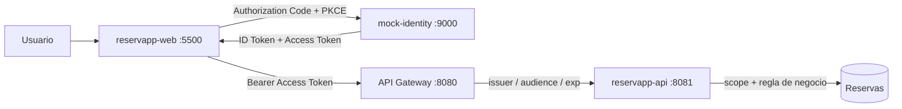
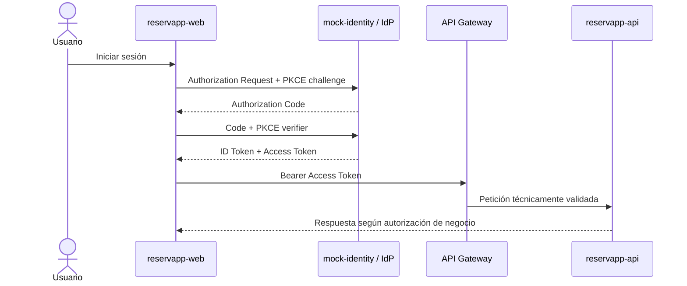
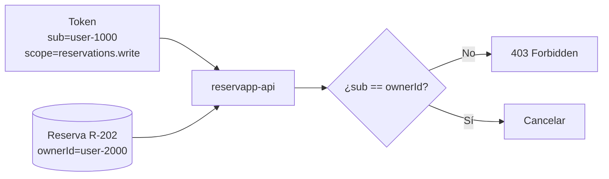
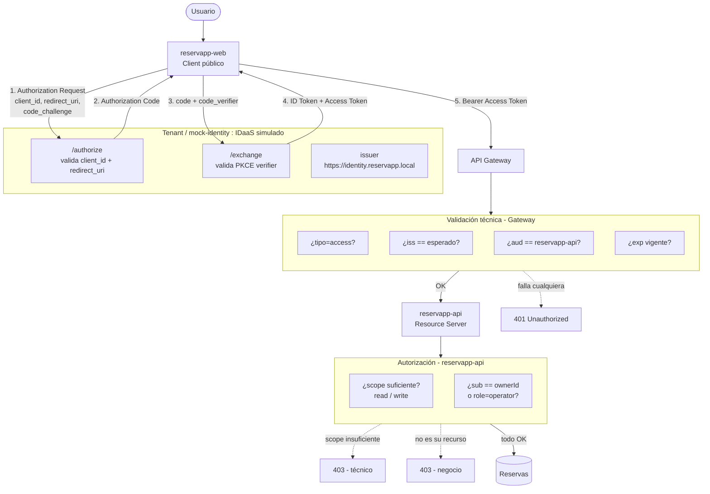

# Laboratorio · ReservApp · Identidad, autorización e IDaaS

**Asignatura:** DSY1107 · Desarrollo Cloud Native I · Sección 002D
**Modalidad:** individual
**Prerequisito:** [Laboratorio 1 · API Gateway](../api-gateway/) (Semana 01)

> `mock-identity` es un **simulador didáctico**, no un proveedor OAuth2/OIDC real. Sus tokens son strings `campo|campo|...` codificados en Base64URL, no JWT firmados. El código no debe reutilizarse como seguridad de producción.

## 1. Arquitectura



| Componente | Rol conceptual | Puerto |
|---|---|---|
| `client/index.html` | Client (OAuth2/OIDC) | 5500 |
| `mock-identity` | Authorization Server / IdP | 9000 |
| `gateway` | Validación técnica transversal | 8080 |
| `reservapp-api` | Resource Server + autorización de negocio | 8081 |

## 2. Cómo ejecutar

Requiere JDK 21+, Maven 3.9+, Python 3 (para servir el cliente).

```bash
cd mock-identity && mvn spring-boot:run     # terminal 1 → :9000
cd reservapp-api && mvn spring-boot:run     # terminal 2 → :8081
cd gateway && mvn spring-boot:run           # terminal 3 → :8080
cd client && python3 -m http.server 5500    # terminal 4 → :5500
```

Abrir `http://localhost:5500`. La URL importa: `mock-identity` solo reconoce esa `redirect_uri`.

## 3. Usuarios del simulador

| Usuario | `sub` | Rol |
|---|---|---|
| Ana | `user-1000` | `customer` |
| Bruno | `user-2000` | `customer` |
| Operador | `user-9000` | `operator` |

Reservas: `R-101` (Ana), `R-202` (Bruno), `R-303` (Ana).

---

## 4. Etapa B · "Continuar con Google" vs "Conectar Google Drive"

### Caso 1 · Continuar con Google (identidad)

1. No, la aplicación nunca recibe la contraseña de Google.
2. Resolvemos **quién es el usuario** — un problema de identidad/autenticación.
3. Google es el **Identity Provider**: autentica y entrega un resultado verificable.
4. Es OIDC puro: el propósito es informar identidad al cliente (equivalente al `ID Token` que emite `mock-identity`).

### Caso 2 · Conectar Google Drive (autorización)

1. No. El login solo confirma identidad; acceder a Drive requiere una autorización **adicional y explícita**.
2. Aparece un recurso protegido nuevo: los archivos del usuario en Drive.
3. Porque autenticación y autorización son decisiones distintas — estar identificado no implica tener permiso sobre cualquier recurso.
4. Es OAuth2: autorización delegada, limitada por scope, representada por un Access Token.

```text
reconocer quién eres ≠ obtener permiso para usar otro recurso
```

En el lab esto se ve directo: el `ID Token` (identidad) y el `Access Token` (autorización sobre `reservapp-api`) se emiten juntos, pero cumplen roles distintos — ver Etapa D.

---

## 5. Etapa C · Authorization Code + PKCE (evidencia real)

Ejecutado en el cliente real (`http://localhost:5500`) como **Ana**, con `reservations.read`.

**Traza observada:**

```text
1. El cliente genera code_verifier y code_challenge...
2. Authorization Request
   client_id=reservapp-web
   redirect_uri=http://localhost:5500/index.html
   scope=reservations.read
   audience=reservapp-api
   code_challenge=Tdm0N60qGs6zQ6AjGf3N6qpGz8cxDyyiPTtQIjZkrN0
3. IdP devuelve Authorization Code
   027fbc6f-e5e8-44a5-a31c-e583a5054c4d
4. Cliente intercambia Code + code_verifier
5. IdP emite ID Token + Access Token
   issuer=https://identity.reservapp.local
   expiresIn=3600s
```

**Tokens decodificados (Base64URL, no JWT real):**

```text
ACCESS TOKEN:
access|user-1000|https://identity.reservapp.local|reservapp-api|reservations.read|customer|1787679292

ID TOKEN:
id|user-1000|https://identity.reservapp.local|ana|ana@example.edu|1787679292
```

### Diagrama del flujo observado



### Preguntas

- **¿Por qué `Client ID` no es una contraseña?** Identifica al software (`reservapp-web`), no autentica a nadie. No es secreto: el proveedor lo usa para recuperar la configuración del cliente (redirect URIs permitidas, flujo esperado).
- **¿Por qué la redirect URI debe estar registrada?** Si el IdP aceptara cualquier URL, un atacante podría desviar el resultado de autenticación hacia un sitio propio. Verificado en la Etapa K.
- **¿Qué intenta proteger PKCE?** Que solo quien inició el flujo (quien generó el `code_verifier`) pueda canjear el `Authorization Code` — protege contra interceptación del código en tránsito.
- **¿Por qué una SPA se considera cliente público?** Corre en el navegador del usuario; cualquier secreto embebido en su JavaScript es inspeccionable.
- **¿Por qué no colocaríamos un client secret en JavaScript frontend?** Porque dejaría de ser secreto — cualquiera con DevTools lo vería. Por eso `reservapp-web` no usa `client_secret`, solo PKCE.

---

## 6. Etapa D · Access Token vs ID Token

| | Access Token | ID Token |
|---|---|---|
| Estructura decodificada | `access\|sub\|iss\|aud\|scope\|role\|exp` | `id\|sub\|iss\|user\|email\|exp` |
| Dirigido a | El recurso protegido (`reservapp-api`) | El cliente (`reservapp-web`) |
| Propósito | Autorizar una operación | Informar quién se autenticó |

**Prueba:** se reemplazó el Access Token por el ID Token y se ejecutó `GET /api/reservations` a través del gateway.

```http
HTTP/1.1 401
{"status":401,"message":"Se esperaba un access token didáctico, no un ID token"}
```

- **Status:** `401`
- **Componente que rechaza:** el **Gateway** (`DidacticTokenFilter`), antes de llegar a `reservapp-api`
- **Motivo:** el primer campo decodificado es `id`, no `access` — el filtro lo detecta explícitamente
- **Diferencia de propósito:** el ID Token nunca debió presentarse ante un recurso protegido; solo describe la autenticación realizada

```text
ID Token     → informa al Client quién se autenticó
Access Token → se presenta ante el recurso protegido
```

---

## 7. Etapa E · Scopes y mínimo privilegio

### E1 · Solo lectura (Ana, `reservations.read`)

| Operación | Resultado |
|---|---|
| `GET /api/reservations` | `200` — devuelve solo las reservas de Ana (`R-101`, `R-303`) |
| `DELETE /api/reservations/R-101` | `403 Forbidden` |

- **¿Por qué una funciona y la otra no?** El scope `reservations.read` autoriza lectura, no escritura. `DELETE` requiere `reservations.write`, que no fue solicitado.
- **¿Qué scope falta?** `reservations.write`.
- **¿Por qué no pedir `write` si solo se necesita consultar?** Principio de mínimo privilegio — un token con más permisos de los necesarios amplía innecesariamente el daño posible si se filtra o se usa mal.

### E2 · Lectura y escritura (Ana, `reservations.read reservations.write`)

```http
DELETE /api/reservations/R-101
HTTP/1.1 200
{"id":"R-101","result":"CANCELLED","authorizedAs":"customer"}
```

Con el scope correcto, la cancelación de su propia reserva funciona.

---

## 8. Etapa F · 401: fallos de autenticación/validación técnica

| Prueba | Status | Componente que rechaza | Validación que falló |
|---|---:|---|---|
| **F1** Sin token | `401` | Gateway | No hay header `Authorization` |
| **F2** Audience incorrecta (`otra-api`) | `401` | Gateway | `aud` del token ≠ `reservapp-api` esperada |
| **F3** ID token usado como Bearer | `401` | Gateway | Tipo de token — se esperaba `access`, llegó `id` |

Las tres pruebas fallan **antes de llegar a `reservapp-api`** — el Gateway centraliza la validación técnica (issuer, audience, tipo de token, expiración) para no repetirla en cada backend.

> **Sobre expiración:** el simulador no permite adelantar el reloj, pero el filtro compara `exp` (epoch en segundos) contra `Instant.now()`. Si `exp` quedara en el pasado, el Gateway respondería `401 Token expirado` con el mismo mecanismo que usa para issuer/audience — es la misma línea de código, solo cambia qué condición falla.

**Nota adicional (no pedida, mientras se investigaba):** llamando a `reservapp-api` **directo**, sin pasar por el Gateway y sin header `Authorization`, el resultado es `400 Bad Request` (Spring rechaza la falta de un `@RequestHeader` obligatorio) — no `401`. El `401` bien formado con mensaje explícito es una decisión del Gateway (`DidacticTokenFilter`), no un comportamiento automático de Spring.

---

## 9. Etapa G · 403 por autorización técnica

Ana, con **solo** `reservations.read`, intenta `DELETE /api/reservations/R-101`:

```http
HTTP/1.1 403 Forbidden
```

- **¿Por qué no es igual a "sin token"?** Aquí el token **es válido** — el Gateway ya lo dejó pasar. El rechazo ocurre en `reservapp-api`, evaluando permisos, no autenticación.
- **Diferencia 401 vs 403:** `401` = no hay identidad válida. `403` = identidad válida, pero sin el permiso necesario para esta operación.
- **Componente que decide por scope:** `reservapp-api` (`ReservationController.requireScope`), no el Gateway — el Gateway no conoce los scopes de negocio, solo issuer/audience/exp.

---

## 10. Etapa H · 403 por autorización de negocio

Ana, con `reservations.read reservations.write` (scope técnico suficiente):

| Operación | Resultado |
|---|---|
| `DELETE /api/reservations/R-202` (reserva de **Bruno**) | `403 Forbidden` |
| `DELETE /api/reservations/R-101` (reserva **propia**) | `200 CANCELLED` |

1. **¿Por qué `reservations.write` no basta?** El scope autoriza la *capacidad general* de escribir, no *sobre cuál* recurso. Falta comparar propiedad.
2. **Dato del token que identifica al sujeto:** `sub` (`user-1000` para Ana).
3. **Dato del dominio a comparar:** `ownerId` de la reserva (`user-2000` para `R-202`).
4. **¿Por qué en el backend y no en el Gateway?** El Gateway no tiene acceso a los datos de negocio (qué reserva pertenece a quién) — esa información vive en `reservapp-api`, junto a la base de datos de reservas.



---

## 11. Etapa I · Roles: customer vs operator

Operador, con `reservations.read reservations.write`:

| Operación | Resultado |
|---|---|
| `GET /api/reservations` | `200` — devuelve **las 3 reservas** (no filtra por `ownerId`) |
| `DELETE /api/reservations/R-202` (de Bruno, no del operador) | `200 CANCELLED` — permitido |

- **Qué representa `role=operator`:** una función dentro del sistema que exime de la regla "solo tus propias reservas" — en `ReservationController`, la condición `!token.role().equals("operator")` es lo único que distingue este caso.
- **Role ≠ scope:** el scope (`reservations.write`) autoriza la *capacidad técnica* de escribir; el role decide *el alcance* de esa capacidad sobre datos de terceros. Son dos ejes independientes.
- **Si el operador tuviera `role=operator` pero no `reservations.write`:** seguiría fallando en la Etapa G (`403` por falta de scope) — el rol no reemplaza al scope, ambos deben cumplirse.

---

## 12. Etapa K · App registration — ver [`app-registration-design.md`](app-registration-design.md)

Pruebas de rechazo ejecutadas:

| Prueba | Resultado | Momento del fallo |
|---|---:|---|
| `client_id` no registrado (`reservapp-web-FALSO`) | `400 Bad Request` | En `/authorize`, **antes** de emitir ningún código |
| `redirect_uri` no registrada (`http://evil.example.com/callback`) | `400 Bad Request` | En `/authorize`, **antes** de emitir ningún código |

Ninguna de las dos pruebas llega a generar un 401/403 en `reservapp-api` — el flujo se corta en el IdP, antes de que exista siquiera un `Authorization Code`.

---

## 13. Etapa J · Tenant, IDaaS y CIAM — ver [`tenant-design.md`](tenant-design.md)

## 14. Etapa L · Arquitectura final



---

## 15. Matriz de errores (completa, con evidencia)

| Prueba | Resultado esperado | Resultado obtenido |
|---|---|---:|
| `client_id` no registrado | flujo de autorización rechazado | ✅ `400` en `/authorize` |
| `redirect_uri` no registrada | flujo de autorización rechazado | ✅ `400` en `/authorize` |
| Access Token válido + `read` | lectura permitida | ✅ `200` |
| Sin token | `401` | ✅ `401` |
| ID Token usado como Bearer | `401` | ✅ `401` |
| Audience incorrecta | `401` | ✅ `401` |
| Sin `reservations.write` | `403` | ✅ `403` |
| Customer cancela reserva ajena | `403` | ✅ `403` |
| Customer cancela reserva propia con scope | permitido | ✅ `200` |
| Operator con scope cancela reserva ajena | permitido | ✅ `200` |

Salidas `curl` completas (headers + body) de cada prueba disponibles en `docs/evidencias/`.

---

## 16. OAuth2 vs OIDC vs IAM/IDaaS/CIAM (resumen)

- **OAuth2** resuelve autorización delegada — el Access Token.
- **OIDC** agrega identidad sobre OAuth2 — el ID Token.
- **IAM** es la disciplina completa (procesos + políticas + tecnología para gestionar identidad y acceso).
- **IdP** es el componente concreto que autentica (`mock-identity` en este lab).
- **IDaaS** es consumir esas capacidades como servicio administrado — no implica que ReservApp deje de diseñar su propio modelo de autorización.
- **CIAM** es la especialización de IAM para clientes externos (Ana, Bruno) — distinto de un escenario workforce (Operador). Ver `tenant-design.md`.

## 17. Qué cambiará al reemplazar `mock-identity` por un proveedor real

- El **issuer** dejará de ser `https://identity.reservapp.local` y pasará al dominio real del proveedor.
- Los tokens dejarán de ser strings `campo|campo` en Base64URL y serán **JWT firmados** — habrá que verificar la firma criptográficamente (clave pública/JWKS), no solo decodificar.
- Los endpoints `/authorize` y `/exchange` de `mock-identity` serán reemplazados por los del proveedor.
- **No cambia:** el flujo Authorization Code + PKCE en sí, los scopes de negocio (`reservations.read/write`), ni la regla de negocio `sub == ownerId` en `reservapp-api`.

## Checkpoint

No se desecha esta aplicación ni los documentos — quedan como base para reemplazar progresivamente `mock-identity` por infraestructura real, sin recomenzar desde cero.
