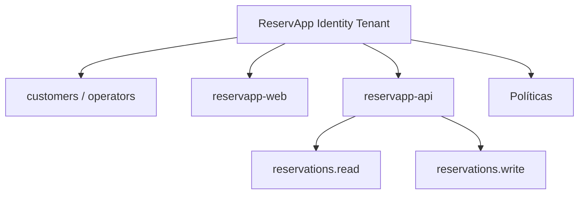

# Tenant design · ReservApp

Diseño conceptual del tenant de identidad de ReservApp, mapeado sobre la aplicación que corre en este laboratorio (`mock-identity` + `gateway` + `reservapp-api` + `client`).

## Diagrama



## A. Poblaciones de usuario

| Población | Ejemplo en el lab | Diferencia real de negocio |
|---|---|---|
| **customer** | Ana, Bruno | Usuario externo. Gestiona únicamente **sus propias** reservas. Se autoregistraría en un escenario real, sin intervención administrativa. |
| **operator** | Operador | Usuario interno/staff. Puede operar reservas de **cualquier** cliente. Se le da de alta administrativamente, no se autoregistra. |

La distinción no es cosmética: en `ReservationController`, `role=operator` es la única condición que exime de la regla "solo tus propias reservas" (`GET` no filtra por `ownerId`; `DELETE` no exige `sub == ownerId`).

## B. Aplicaciones

| App | Rol | Detalle |
|---|---|---|
| `reservapp-web` | **Client** | Inicia el flujo de autenticación, solicita tokens, los usa para invocar la API. Solicita tokens al IdP. |
| `reservapp-api` | **Resource Server** | Consume access tokens. Nunca solicita tokens — solo los recibe y valida (issuer, audience, scope, regla de negocio). |

`reservapp-web` es quien **solicita** tokens (a través del flujo Authorization Code + PKCE contra `mock-identity`). `reservapp-api` es quien **consume** access tokens, presentados por el Gateway después de la validación técnica.

## C. Scopes

Partiendo de:

```text
reservations.read
reservations.write
```

- **¿Necesitamos otro scope?** No por ahora. Las dos operaciones observadas (`GET` y `DELETE`) se cubren completamente con estos dos scopes. Agregar un tercero (ej. `reservations.admin`) sin una operación real que lo requiera sería crear permisos "por si acaso", contrario al principio de mínimo privilegio que vimos en la Etapa E.
- **¿Se está creando por necesidad real o por completar una lista?** Los dos scopes actuales corresponden 1 a 1 con los verbos HTTP que la API expone (`read` → `GET`, `write` → `DELETE`, y eventualmente `POST`/`PUT` si se agregan). No hay scopes decorativos.

## D. Claims

| Claim | Presente en | Por qué es necesario |
|---|---|---|
| `sub` | Access Token, ID Token | Identifica al sujeto de forma estable — es lo que `reservapp-api` compara contra `ownerId` para la regla de negocio (Etapa H). |
| `iss` | Access Token, ID Token | Permite a la API confiar (o no) en quién emitió el token — frontera de confianza del tenant. |
| `aud` | Access Token | Evita que un token emitido para otra API sea aceptado aquí (Etapa F2). |
| `scope` | Access Token | Capacidad delegada — decide `read`/`write` (Etapa E). |
| `role` | Access Token | Distingue `customer` de `operator` para la autorización de negocio (Etapa I). |
| `exp` | Access Token, ID Token | Limita la vigencia del token. |

Deliberadamente **no** se incluye en el token el historial de reservas, preferencias, ni ningún otro dato de negocio — ver pregunta de razonamiento más abajo.

## E. Confianza — qué debe validar `reservapp-api`

En este laboratorio la validación técnica ocurre en el **Gateway** (`DidacticTokenFilter`), antes de llegar a `reservapp-api`:

1. Que el token sea de tipo `access`, no `id` (Etapa D/F3).
2. Que el `iss` sea el esperado (`https://identity.reservapp.local`).
3. Que el `aud` sea `reservapp-api` (Etapa F2).
4. Que no esté expirado (`exp`).

`reservapp-api` asume que un token que llegó hasta ahí ya pasó esa validación, y agrega su propia capa:

5. Que el `scope` incluya la capacidad requerida por la operación (Etapa G).
6. Que la regla de negocio se cumpla (`sub == ownerId`, salvo `role=operator`) (Etapa H).

## F. Preguntas de razonamiento

**1. ¿Por qué un tenant puede contener más de una aplicación?**
Porque el tenant es el contenedor lógico de confianza — agrupa identidades, políticas y configuración compartida. `reservapp-web` y `reservapp-api` son dos aplicaciones registradas dentro del mismo tenant, no dos tenants distintos; comparten el mismo `issuer` y las mismas identidades de usuario.

**2. ¿Por qué `client_id` no identifica a un usuario?**
Identifica software (`reservapp-web`), no una persona. Todos los usuarios (Ana, Bruno, Operador) inician sesión a través del mismo `client_id` — quien los distingue es `sub`, no `client_id`.

**3. ¿Qué problema existiría si `reservapp-api` aceptara tokens de cualquier issuer?**
Cualquier emisor de tokens (incluido uno malicioso) podría generar un token con `aud=reservapp-api` y forzar acceso, sin haber pasado por el proceso real de autenticación del tenant. El `iss` es la frontera de confianza — validarlo es literalmente lo que impide esto.

**4. ¿Qué ocurriría si el token tiene audience para otra API?**
Se rechaza con `401` (Etapa F2), incluso si viene del mismo `mock-identity` y con firma/estructura correcta — un token emitido para `otra-api` nunca debería servir para `reservapp-api`, aunque comparta emisor.

**5. ¿Conviene poner en el token el historial completo de reservas del usuario? ¿Por qué?**
No. El token puede quedar desactualizado apenas se emite (las reservas cambian, el token no). Además, agrandaría el token innecesariamente y filtraría datos de negocio en cada petición, incluso a componentes que no los necesitan (como el Gateway, que solo valida issuer/audience/exp). Mejor: el token trae `sub`, y `reservapp-api` consulta el estado actual en su propia base de datos — que es exactamente lo que hace en la Etapa H.

**6. ¿Tenant de identidad y tenant de negocio significan siempre lo mismo?**
No. Aquí trabajamos exclusivamente el tenant de **identidad** — el espacio que agrupa usuarios, apps y políticas de autenticación/autorización. Un tenant de **negocio** (multitenancy SaaS) representaría organizaciones o clientes aislados dentro del dominio de ReservApp — un concepto relacionado pero distinto, fuera del alcance de este laboratorio.

## G. ¿Qué está simulando `mock-identity`?

Simula el rol de **Authorization Server / Identity Provider** dentro de un IDaaS: autentica (de forma simplificada, sin login real de contraseña), conoce el cliente registrado (`reservapp-web`), aplica la validación de `redirect_uri`, ejecuta el intercambio PKCE, y emite Access Token + ID Token. Lo que **no** simula: firma criptográfica real (JWT), MFA, recuperación de cuenta, ni persistencia de usuarios más allá de un `switch` hardcodeado.

## H. ¿Por qué ReservApp es un escenario cercano a CIAM?

Ana y Bruno son consumidores externos de la aplicación — gestionan sus propias reservas, no necesitan intervención administrativa para existir en el sistema, y la experiencia debe ser simple (login, ver mis reservas, cancelar). Eso es CIAM. El Operador, en cambio, es una población de tipo workforce: se le asigna manualmente el rol, y su ciclo de vida depende de la organización, no de su propia voluntad de registrarse.
