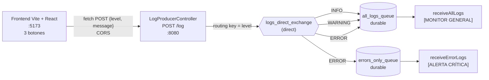

# Laboratorio 2.1.3 · Exchanges, bindings y routing keys aplicados al caso

**Asignatura:** DSY1107 · Desarrollo Cloud Native I
**Actividad:** 2.1.3 · Sistema de logging con `DirectExchange`
**Modalidad:** individual · **Entrega:** repositorio GitHub

## 1. Integrantes

- Jonathan Larraguibel

## 2. Objetivo

Construir un sistema de logging en el que los mensajes se **enrutan según su severidad** (`INFO`, `WARNING`, `ERROR`):

- Una cola `all_logs_queue` recibe **todos** los logs (monitor general).
- Una cola `errors_only_queue` recibe **solo** los `ERROR` (alertas críticas).

Para lograrlo se usa un `DirectExchange`, dos colas y cuatro bindings con routing keys. Un frontend Vite + React envía los logs al backend Spring Boot por HTTP.

Diferencia con el lab anterior ([`../rabbitmq`](../rabbitmq)): ahí se publicaba en el **exchange por defecto** directamente a una cola. Aquí el productor publica en un **exchange propio** y es RabbitMQ quien decide, según los bindings, a qué colas llega cada mensaje.

## 3. Arquitectura



### Tabla de enrutamiento

| Routing key del mensaje | `all_logs_queue` | `errors_only_queue` | Consumidores que reaccionan |
|---|:---:|:---:|---|
| `INFO` | ✅ | — | Monitor general |
| `WARNING` | ✅ | — | Monitor general |
| `ERROR` | ✅ | ✅ | Monitor general **y** alerta crítica |
| `DEBUG` u otra | — | — | Ninguno: el mensaje se descarta (ver sección 8) |

## 4. Requisitos

- Docker Desktop
- JDK 21+ y Maven 3.9+
- Node.js 20+ y npm

## 5. Cómo ejecutar

Se necesitan 3 procesos, en este orden:

```bash
# 1. RabbitMQ (desde labs/rabbitmq-routing)
docker compose up -d

# 2. Backend (otra terminal)
cd logging-system
mvn clean package
java -jar target/logging-system-0.0.1-SNAPSHOT.jar

# 3. Frontend (otra terminal)
cd logging-frontend
npm install
npm run dev        # http://localhost:5173
```

Prueba sin frontend:

```bash
curl -X POST http://localhost:8080/log \
  -H "Content-Type: application/json" \
  -d '{"level":"ERROR","message":"No se pudo conectar a la base de datos."}'
```

## 6. Estructura

```text
labs/rabbitmq-routing/
├── README.md
├── docker-compose.yml                       # RabbitMQ 4.2 + management
├── docs/
│   └── evidencias.md
├── logging-system/                          # Backend Spring Boot
│   ├── pom.xml                              # starter-amqp + starter-webmvc
│   └── src/main/
│       ├── java/com/example/loggingsystem/
│       │   ├── LoggingSystemApplication.java
│       │   ├── RabbitMQConfig.java          # Paso 1.2: exchange, colas, bindings
│       │   ├── LogConsumer.java             # Paso 1.3: consumidores
│       │   └── LogProducerController.java   # Paso 1.4: productor REST + CORS
│       └── resources/application.properties
└── logging-frontend/                        # Frontend Vite + React
    ├── package.json
    └── src/
        ├── App.jsx                          # Paso 2.2: botones + fetch
        └── App.css
```

## 7. Resultado

| Prueba | Resultado |
|---|---|
| Topología en RabbitMQ | 1 exchange `direct`, 2 colas durables, 4 bindings (`rabbitmqctl list_bindings`) |
| Botón **INFO** | Solo `[MONITOR GENERAL]` |
| Botón **WARNING** | Solo `[MONITOR GENERAL]` |
| Botón **ERROR** | `[MONITOR GENERAL]` **y** `[ALERTA CRÍTICA]` |
| CORS desde `:5173` | Preflight `200` con `Access-Control-Allow-Origin: http://localhost:5173` |
| CORS desde otro origen | Preflight `403` |
| Routing key `DEBUG` / `error` | Ninguna cola lo recibe (se descarta) |

Detalle y salidas reales en [`docs/evidencias.md`](docs/evidencias.md).

## 8. Problemas encontrados y observaciones

1. **Versión del parent en el `pom.xml`.** Al generar el proyecto desde la API de Spring Initializr con `bootVersion=4.1.1.RELEASE`, el `pom.xml` quedó con `<version>4.1.1.RELEASE</version>`, que no existe en Maven Central (`Non-resolvable parent POM`). Se corrigió a `4.1.1`.
2. **"Spring Web" en Spring Boot 4.** Initializr agrega `spring-boot-starter-webmvc` en lugar de `spring-boot-starter-web`, que es lo que muestra la guía. Es el mismo starter con su nombre nuevo en Boot 4.
3. **Mensajes que no coinciden con ningún binding se pierden en silencio.** Un `DirectExchange` compara la routing key de forma **exacta**, distinguiendo mayúsculas de minúsculas. `DEBUG` o `error` no coinciden con ningún binding, así que RabbitMQ los descarta, aunque la API igual responde `Log enviado`. En producción se resolvería así:
   - validando el `level` en el controller (aceptar solo `INFO`, `WARNING` o `ERROR`), o
   - publicando con `mandatory=true` y un `ReturnsCallback`, o configurando un *alternate exchange* que reciba lo que no se pudo enrutar.
4. **La conclusión de la guía dice "enrutamiento por topics".** En realidad lo implementado es enrutamiento **direct** (tutorial 4, *Routing*). El enrutamiento por *topics* usa `TopicExchange` con comodines (`*`, `#`) y corresponde al tutorial 5.

## 9. Conclusiones

- El **productor no sabe qué colas existen**: solo publica en `logs_direct_exchange` con el nivel como routing key. Agregar un tercer destino (por ejemplo, una cola de auditoría) solo requiere un binding nuevo, sin tocar el productor.
- **Una cola puede tener varios bindings**: `all_logs_queue` recibe `INFO`, `WARNING` y `ERROR`.
- **Varias colas pueden compartir una routing key**: `ERROR` llega a las dos colas. Cada cola recibe **su propia copia**, a diferencia del lab anterior, donde dos consumidores de la **misma** cola se repartían los mensajes (round-robin).
- Los **consumidores no conocen el enrutamiento**: cada uno solo escucha su cola.
- `@CrossOrigin` es necesario porque el frontend (`:5173`) y el backend (`:8080`) son orígenes distintos para el navegador.
