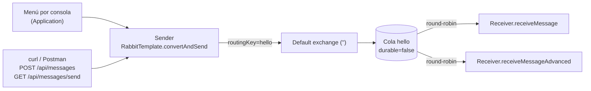

# Laboratorio 2.1.2 · Hello World con RabbitMQ en Docker

**Asignatura:** DSY1107 · Desarrollo Cloud Native I
**Actividad:** 2.1.2 · Crear cola, productor y consumidor básicos (Hello World)
**Modalidad:** individual · **Entrega:** repositorio GitHub

## 1. Integrantes

- Jonathan Larraguibel

## 2. Objetivo

Construir el primer sistema de mensajería asíncrona con RabbitMQ:

- Levantar RabbitMQ con Docker Compose.
- Declarar una cola (`hello`).
- Implementar un productor (`Sender`) y un consumidor (`Receiver`) con Spring AMQP.
- Probar la comunicación end-to-end (menú por consola y endpoint REST).
- Monitorear la cola desde el Management UI.

Base: [tutorial oficial RabbitMQ “Hello World” con Spring AMQP](https://www.rabbitmq.com/tutorials/tutorial-one-spring-amqp).

## 3. Arquitectura



Productor y consumidor viven en la misma app Spring Boot (`:8080`), pero solo se comunican a través del broker (`localhost:5672`): el `Sender` nunca llama al `Receiver`.

## 4. Requisitos

- Docker Desktop (Docker Compose v2)
- JDK 21+ (probado con OpenJDK 24/26)
- Maven 3.9+ (o el wrapper `./mvnw`)
- `curl`

## 5. Cómo ejecutar

### 5.1 Levantar RabbitMQ

```bash
docker compose up -d
docker compose ps        # STATUS debe decir (healthy)
docker exec rabbitmq rabbitmq-diagnostics ping   # -> Ping succeeded
```

Management UI: <http://localhost:15672> (usuario `guest`, contraseña `guest`).

### 5.2 Compilar y ejecutar la app

```bash
cd rabbitmq-tutorials
mvn clean package        # genera target/rabbitmq-tutorials-0.0.1-SNAPSHOT.jar
java -jar target/rabbitmq-tutorials-0.0.1-SNAPSHOT.jar
```

También sirve `mvn spring-boot:run`.

### 5.3 Enviar mensajes

Desde el menú interactivo: opción `1` (un mensaje) u opción `2` (N mensajes).

Desde otra terminal, vía REST:

```bash
curl -X POST http://localhost:8080/api/messages \
  -H "Content-Type: application/json" \
  -d '{"message":"Hola desde REST API!"}'

curl "http://localhost:8080/api/messages/send?message=HelloWorld"
```

## 6. Estructura

```text
labs/rabbitmq/
├── README.md
├── docker-compose.yml                 # Paso 1: RabbitMQ 4.2 + management
├── docs/
│   ├── evidencias.md
│   └── capturas/                      # Management UI (Overview, Queues, Exchanges, Connections, Channels, Overview con app) + terminal
└── rabbitmq-tutorials/
    ├── pom.xml                        # spring-boot-starter-amqp + web
    └── src/
        ├── main/java/com/example/
        │   ├── Application.java       # Paso 7: main + menú interactivo
        │   ├── RabbitMQConfig.java    # Paso 4: bean Queue("hello", false)
        │   ├── Sender.java            # Paso 5: productor
        │   ├── Receiver.java          # Paso 6: consumidor(es)
        │   └── MessageController.java # Paso 9: endpoint REST
        ├── main/resources/application.yml  # Paso 3
        └── test/java/com/example/ApplicationTests.java
```

## 7. Resultado

| Prueba | Resultado |
|---|---|
| `docker compose ps` | `rabbitmq` Up (healthy) |
| `mvn clean package` | BUILD SUCCESS, test `contextLoads` OK, JAR generado |
| Menú opción 1 | Mensaje enviado y recibido |
| Menú opción 2 (3 mensajes) | 3 enviados, 3 recibidos |
| `POST /api/messages` | `200 Mensaje enviado: Hola desde REST API!` + recibido |
| `GET /api/messages/send` | `200 Mensaje enviado: HelloWorld` + recibido |
| Cola `hello` (Management API) | `messages: 0`, `consumers: 2`, `durable: false` |

Salidas completas y capturas del Management UI en [`docs/evidencias.md`](docs/evidencias.md).

## 8. Problemas encontrados

1. **Dos clases `@SpringBootApplication`.** Spring Initializr generó `com.example.rabbitmq_tutorials.RabbitmqTutorialsApplication` y la guía pide `com.example.Application`. Con dos `main`, el plugin de Spring Boot no sabe cuál empaquetar, y la del Initializr no escanea `Sender`/`Receiver` (están en el paquete padre). Solución: eliminar la clase del Initializr y mover el test a `com.example`.
2. **Doble ack en `receiveMessageAdvanced`.** Con las líneas `channel.basicAck(...)` activas y el listener en modo `AUTO` (el por defecto), Spring también confirma el mensaje; el segundo ack usa un delivery tag ya confirmado y RabbitMQ cierra el canal con `PRECONDITION_FAILED - unknown delivery tag`. Solución: dejar `basicAck`/`basicNack` comentados, como en la guía; solo corresponden si se configura `acknowledge-mode: manual`.
3. **`application.properties` y `application.yml` duplicados.** Se eliminó el `.properties` generado por el Initializr para que la configuración viva en un solo archivo.

## 9. Observaciones

- **Dos consumidores sobre la misma cola.** `Receiver` tiene dos métodos `@RabbitListener(queues = "hello")`, así que la cola tiene 2 consumidores y RabbitMQ reparte los mensajes en **round-robin**: cada mensaje lo procesa uno solo (se ve en la evidencia: uno imprime `[hh:mm:ss] Mensaje recibido`, el otro `[OK] Mensaje recibido` + `Content-Type`). Es un adelanto del patrón *Work Queues*.
- **Cola no durable.** `new Queue("hello", false)` se pierde si el broker se reinicia; en producción se usaría `durable=true` y mensajes persistentes.
- **Exchange por defecto.** `convertAndSend("hello", msg)` publica en el exchange `""`, que enruta directamente a la cola cuyo nombre coincide con la routing key.

## 10. Conclusiones

- El productor y el consumidor quedan **desacoplados**: el `Sender` solo conoce el nombre de la cola, no quién consume ni cuántos consumidores hay.
- Spring AMQP abstrae la conexión, la declaración de la cola (bean `Queue` → `RabbitAdmin`), la serialización y el ack automático; comparado con el cliente Java/Pika “crudo”, el código es mucho más declarativo.
- El broker actúa como amortiguador: si el consumidor no está levantado, los mensajes se acumulan en la cola y se entregan al conectarse.
