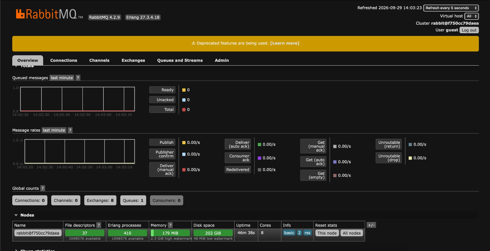
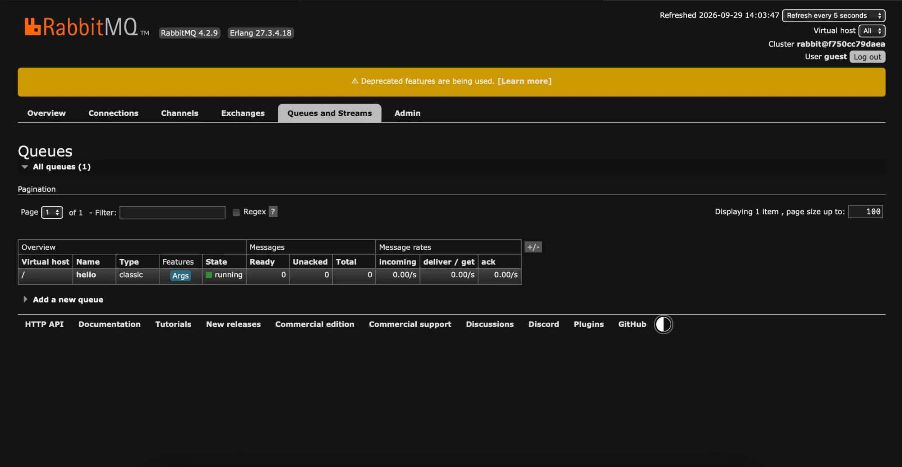
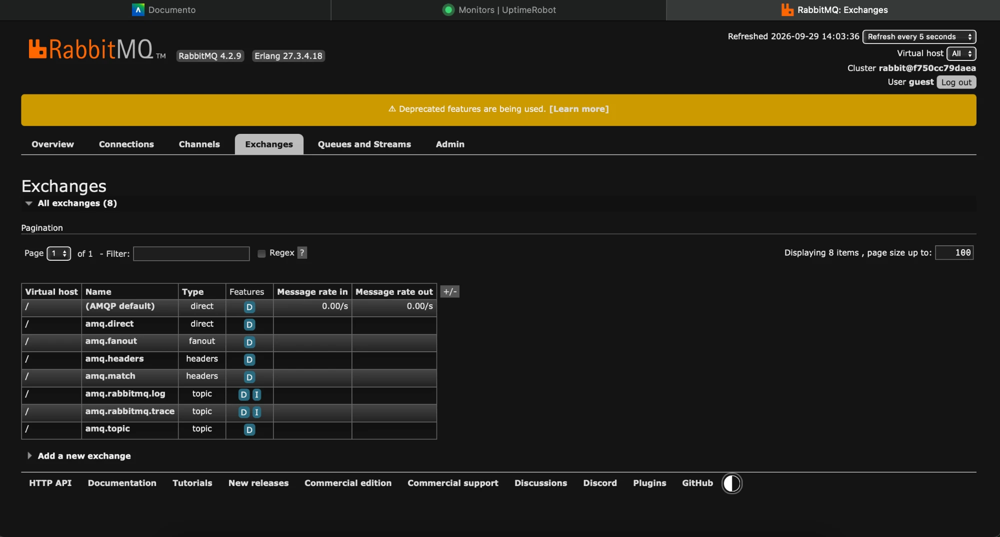
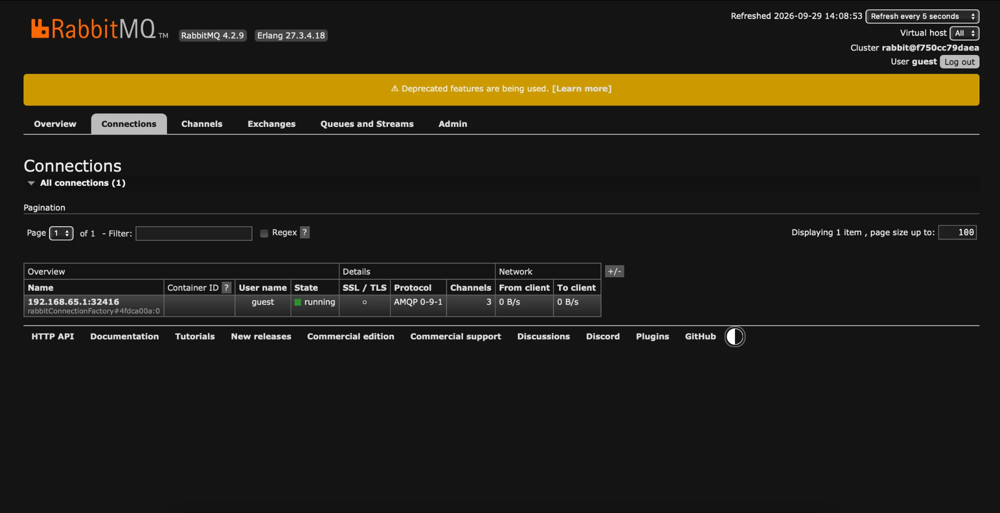
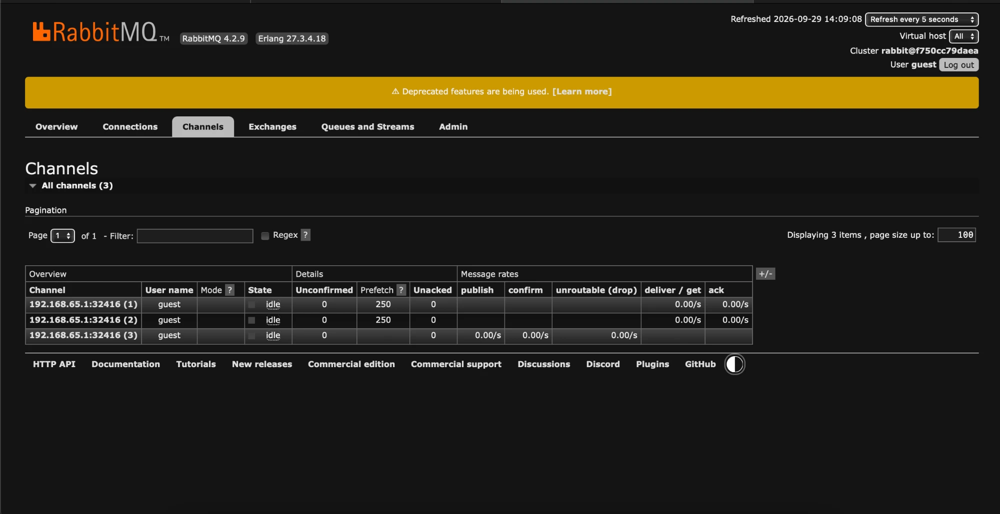
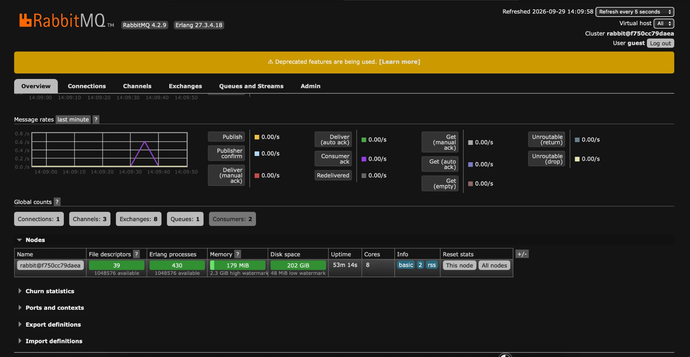
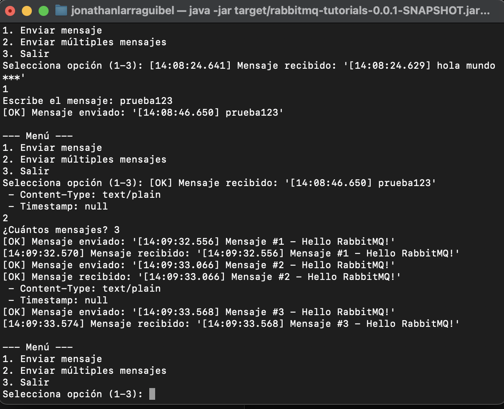

# Evidencias · Hello World con RabbitMQ

Todas las salidas son reales, capturadas el 2026-09-29 en macOS con Docker Desktop, RabbitMQ `4.2-management`, Spring Boot 4.1.1 y OpenJDK 26.

## 1. RabbitMQ levantado (Paso 1)

```text
$ docker compose ps
NAME       IMAGE                     SERVICE    STATUS                    PORTS
rabbitmq   rabbitmq:4.2-management   rabbitmq   Up 32 minutes (healthy)   0.0.0.0:5672->5672/tcp, 0.0.0.0:15672->15672/tcp

$ docker exec rabbitmq rabbitmq-diagnostics ping
Ping succeeded
```

## 2. Compilación (Paso 8.1)

```text
$ mvn clean package
...
Found @SpringBootConfiguration com.example.Application for test class com.example.ApplicationTests
CachingConnectionFactory : Created new connection: rabbitConnectionFactory#...[delegate=amqp://guest@127.0.0.1:5672/]
RabbitAdmin              : Auto-declaring a non-durable, auto-delete, or exclusive Queue (hello) durable:false, auto-delete:false, exclusive:false.
ApplicationTests         : Started ApplicationTests in 1.598 seconds
Tests run: 1, Failures: 0, Errors: 0, Skipped: 0
BUILD SUCCESS

$ ls target/*.jar
target/rabbitmq-tutorials-0.0.1-SNAPSHOT.jar
```

El log de `RabbitAdmin` muestra que la cola `hello` se declara automáticamente a partir del bean `Queue` de `RabbitMQConfig`.

## 3. Menú interactivo (Pasos 7 y 8.3)

```text
$ java -jar target/rabbitmq-tutorials-0.0.1-SNAPSHOT.jar
Started Application in 1.156 seconds
============================================================
RabbitMQ - Hello World con Spring Boot
============================================================
[OK] Aplicación iniciada correctamente
[OK] RabbitMQ conectado en localhost:5672
[OK] Cola 'hello' lista para usar

--- Menú ---
Selecciona opción (1-3): 1
Escribe el mensaje: Hola RabbitMQ desde Spring Boot!
[OK] Mensaje enviado: '[13:47:58.510] Hola RabbitMQ desde Spring Boot!'
[OK] Mensaje recibido: '[13:47:58.510] Hola RabbitMQ desde Spring Boot!'
 - Content-Type: text/plain
 - Timestamp: null

--- Menú ---
Selecciona opción (1-3): 2
¿Cuántos mensajes? 3
[OK] Mensaje enviado: '[13:48:00.520] Mensaje #1 - Hello RabbitMQ!'
[13:48:00.527] Mensaje recibido: '[13:48:00.520] Mensaje #1 - Hello RabbitMQ!'
[OK] Mensaje enviado: '[13:48:01.027] Mensaje #2 - Hello RabbitMQ!'
[OK] Mensaje recibido: '[13:48:01.027] Mensaje #2 - Hello RabbitMQ!'
 - Content-Type: text/plain
 - Timestamp: null
[OK] Mensaje enviado: '[13:48:01.530] Mensaje #3 - Hello RabbitMQ!'
[13:48:01.538] Mensaje recibido: '[13:48:01.530] Mensaje #3 - Hello RabbitMQ!'
```

Latencia productor → broker → consumidor: ~7–8 ms. Los mensajes se alternan entre `receiveMessage` (formato `[hh:mm:ss] Mensaje recibido`) y `receiveMessageAdvanced` (formato `[OK] Mensaje recibido` + propiedades): **round-robin** entre los 2 consumidores de la cola.

`Timestamp: null` es esperado: `RabbitTemplate` no fija la propiedad AMQP `timestamp` a menos que se configure; la hora que se ve está dentro del cuerpo del mensaje.

## 4. Endpoint REST (Paso 9)

```text
$ curl -X POST http://localhost:8080/api/messages \
    -H "Content-Type: application/json" \
    -d '{"message":"Hola desde REST API!"}'
Mensaje enviado: Hola desde REST API!

$ curl "http://localhost:8080/api/messages/send?message=HelloWorld"
Mensaje enviado: HelloWorld
```

Log de la app:

```text
[OK] Mensaje enviado: '[13:48:06.680] Hola desde REST API!'
[OK] Mensaje recibido: '[13:48:06.680] Hola desde REST API!'
 - Content-Type: text/plain
 - Timestamp: null
[OK] Mensaje enviado: '[13:48:06.695] HelloWorld'
[13:48:06.697] Mensaje recibido: '[13:48:06.695] HelloWorld'
```

## 5. Monitoreo (Paso 10)

Consultado vía la HTTP API del Management plugin (misma información que la pestaña *Queues and Streams* de <http://localhost:15672>), con la app corriendo:

```text
$ curl -u guest:guest http://localhost:15672/api/queues/%2F/hello
name: hello   durable: False   state: running   messages: 0   consumers: 2

$ curl -u guest:guest http://localhost:15672/api/connections
192.168.65.1:33462 -> 172.18.0.2:5672   running   channels: 3
```

- `messages: 0` → todo lo publicado fue consumido.
- `consumers: 2` → los dos `@RabbitListener`.
- 1 conexión con 3 canales: Spring AMQP comparte una sola conexión TCP entre productor y consumidores, con un canal por uso.

## 6. Mensajes con el consumidor detenido

Con la app apagada se publicó un mensaje directo al exchange por defecto y luego se levantó la app:

```text
$ curl -u guest:guest -X POST http://localhost:15672/api/exchanges/%2F/amq.default/publish \
    -d '{"properties":{},"routing_key":"hello","payload":"Mensaje encolado sin consumidor","payload_encoding":"string"}'
{"routed":true}

$ docker exec rabbitmq rabbitmqctl list_queues name messages consumers
hello   1   0

$ java -jar target/rabbitmq-tutorials-0.0.1-SNAPSHOT.jar
[13:49:03.637] Mensaje recibido: 'Mensaje encolado sin consumidor'

$ docker exec rabbitmq rabbitmqctl list_queues name messages consumers
hello   0   0
```

El broker retiene el mensaje mientras no hay consumidores y lo entrega apenas uno se conecta: productor y consumidor no necesitan estar activos al mismo tiempo.

## 7. Capturas del Management UI

Capturas completas (sin recortar) de <http://localhost:15672>. Las de 7.1–7.3 se tomaron a las 14:03 con la app **detenida**, así que *Connections*, *Channels* y *Consumers* aparecen en 0. Las de 7.4–7.7 se tomaron a las 14:08–14:10 con la app **corriendo**.

### 7.1 Overview



- RabbitMQ 4.2.9 sobre Erlang 27.3.4.18, un nodo (`rabbit@f750cc79daea`, el hostname del contenedor Docker).
- *Global counts*: 8 exchanges, 1 cola (`hello`) y 0 conexiones o consumidores, porque la app está apagada.
- *Queued messages* Ready/Unacked/Total en 0: no quedó ningún mensaje sin consumir.
- El aviso amarillo *Deprecated features are being used* es un warning de RabbitMQ 4.x y no afecta el laboratorio.

### 7.2 Queues and Streams: cola `hello`



- La cola `hello` existe en el vhost `/`, es de tipo `classic` y está en estado `running`.
- Ready/Unacked/Total en 0: todo lo publicado se consumió.
- La cola sigue declarada aunque la app se detuvo: es no durable (sobrevive mientras el broker no se reinicie), no *auto-delete*.

### 7.3 Exchanges



- `(AMQP default)` es el exchange `direct` sin nombre que usa `rabbitTemplate.convertAndSend("hello", msg)`: enruta a la cola cuyo nombre coincide con la routing key.
- El resto (`amq.direct`, `amq.fanout`, `amq.topic`, `amq.headers`...) son los exchanges predeclarados del broker. En este lab no se usan; aparecerán en los siguientes tutoriales (Publish/Subscribe, Routing, Topics).

### 7.4 Connections (app corriendo)



- 1 conexión desde `192.168.65.1:32416`, que es el host macOS visto desde la red de Docker Desktop, hacia el broker. Protocolo AMQP 0-9-1, usuario `guest`, estado `running`, sin TLS (entorno local).
- El nombre `rabbitConnectionFactory#4fdca00a:0` lo asigna el `CachingConnectionFactory` de Spring Boot: toda la app comparte **una sola conexión TCP**.
- Esa conexión tiene 3 canales (ver 7.5).

### 7.5 Channels (app corriendo)



| Canal | Prefetch | Columnas con tasa | Rol |
|---|---|---|---|
| `(1)` | 250 | *deliver / get*, *ack* | Consumidor: `Receiver.receiveMessage` |
| `(2)` | 250 | *deliver / get*, *ack* | Consumidor: `Receiver.receiveMessageAdvanced` |
| `(3)` | — | *publish*, *confirm*, *unroutable* | Productor: `RabbitTemplate` del `Sender` |

- Cada `@RabbitListener` obtiene su propio canal, con el prefetch por defecto de Spring AMQP (250 mensajes sin confirmar como máximo).
- El productor publica por un canal distinto de los consumidores, aunque todos van por la misma conexión.
- Todos aparecen en `idle` con tasas en 0.00/s porque en ese momento no se estaban enviando mensajes.

### 7.6 Overview (app corriendo)



- *Global counts*: **Connections: 1, Channels: 3, Consumers: 2**, frente a 0/0/0 en la captura 7.1 con la app detenida. Los valores coinciden con 7.4 (una conexión), 7.5 (tres canales) y con los dos `@RabbitListener`.
- En *Message rates* se ve un pico entre 14:09:30 y 14:09:40, que corresponde al tráfico de mensajes durante la prueba. Después vuelve a 0.00/s.
- Exchanges: 8 y Queues: 1 no cambian: la app no crea exchanges propios y reutiliza la cola `hello`, que ya existía.

### 7.7 Terminal: menú interactivo (Paso 8.3)



- **Opción 1** (`prueba123`): enviado a las `14:08:46.650` y recibido por `receiveMessageAdvanced` (formato `[OK] Mensaje recibido` + `Content-Type: text/plain`).
- **Opción 2** (3 mensajes): cada uno se recibe entre 6 y 14 ms después de enviarse. Los consumidores se alternan: #1 y #3 los procesa `receiveMessage` (prefijo `[hh:mm:ss]`) y #2 lo procesa `receiveMessageAdvanced`. Es el **round-robin** entre los 2 consumidores que se ve en la captura 7.5.
- Los mensajes de las 14:09:32–33 coinciden con el pico de *Message rates* de la captura 7.6.
- Arriba también aparece un mensaje `hola mundo ***` recibido a las 14:08:24, enviado antes del tramo que muestra la captura.
- El texto del receptor aparece mezclado con el prompt `Selecciona opción (1-3):` porque el consumidor corre en su propio hilo (el listener container de Spring AMQP), en paralelo al hilo `main` del menú.

## 8. Checklist de la guía

| Paso | Estado |
|---|---|
| 1. RabbitMQ con Docker Compose | ✅ |
| 2. Proyecto Spring Boot (Initializr) | ✅ |
| 3. `application.yml` | ✅ |
| 4. `RabbitMQConfig` (cola `hello`) | ✅ |
| 5. Productor `Sender` | ✅ |
| 6. Consumidor `Receiver` | ✅ |
| 7. `Application` con menú | ✅ |
| 8. Compilar, ejecutar y probar | ✅ |
| 9. Endpoint REST (opcional) | ✅ |
| 10. Monitoreo en el dashboard | ✅ |
