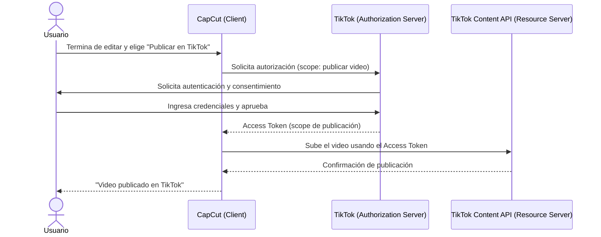
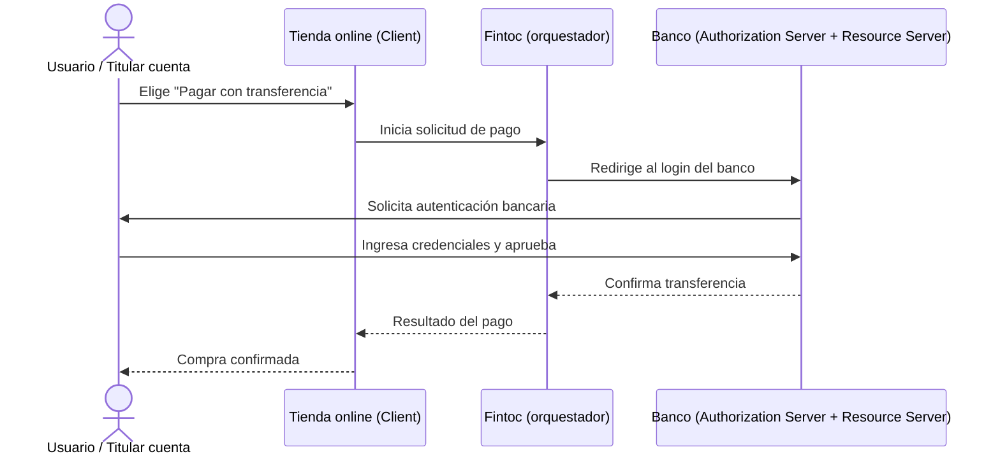

# Investigación de servicios que utilizan OAuth2/OIDC

**Asignatura:** DSY1107 · Desarrollo Cloud Native I
**Actividad:** Investigación de 2 servicios reales que utilicen OAuth2/OIDC — descripción, actores y diagrama.
**Modalidad:** individual

## Integrante

- Jonathan Larraguibel

## Diseño visual completo (diagramas)

Los diagramas de ambos casos están desarrollados en Canva:

🔗 [Ver diseño en Canva](https://canva.link/x8jls7f6pqw9jrn)

Este documento contiene la descripción textual y la determinación de actores de cada servicio; el diseño de Canva contiene la versión visual de los diagramas de flujo.

---

## Ejemplo 1 · CapCut → publicar directamente en TikTok

### Descripción del servicio

CapCut es una aplicación de edición de video. Además de exportar el video editado como archivo, permite **publicarlo directamente en la cuenta de TikTok del usuario** sin salir de la app. Para eso, CapCut no pide la contraseña de TikTok: solicita autorización para publicar en nombre del usuario, y es TikTok quien autentica y aprueba ese permiso.

```text
Usuario edita video → CapCut solicita autorización para publicar en TikTok
→ Usuario aprueba en TikTok → CapCut recibe un Access Token con permiso de publicación
→ CapCut sube el video usando la API de contenido de TikTok
```

### Actores

| Actor | Quién es | Justificación |
|---|---|---|
| **Resource Owner** | El usuario, dueño de su cuenta de TikTok | Su cuenta y su capacidad de publicar son el recurso protegido; él decide si CapCut puede usarla |
| **Client** | CapCut | Solicita la autorización de publicación; nunca recibe la contraseña de TikTok |
| **Authorization Server** | TikTok (su servicio de autenticación/autorización) | Autentica al usuario y gestiona su consentimiento explícito para el permiso de publicación |
| **Resource Server** | La API de publicación de contenido de TikTok | Recibe el Access Token y efectivamente sube el video a la cuenta del usuario |

### Diagrama



---

## Ejemplo 2 · Fintoc — pago con transferencia bancaria

> ⏳ Pendiente de completar (verificación en documentación oficial de Fintoc).

### Descripción del servicio

Cuando una tienda online ofrece la opción "Pagar con transferencia" mediante Fintoc, el usuario no entrega sus credenciales bancarias a la tienda. Es redirigido (a través de Fintoc) al login real de su banco, se autentica ahí y aprueba la transferencia. Ni la tienda ni Fintoc ven la contraseña bancaria del usuario.

### Actores

| Actor | Quién es | Justificación |
|---|---|---|
| **Resource Owner** | El titular de la cuenta bancaria | Es su dinero/cuenta; él decide autorizar la transferencia |
| **Client** | La tienda online que integró Fintoc | Solicita el pago; nunca recibe las credenciales bancarias |
| **Authorization Server** | El banco del usuario | Ahí ocurre la autenticación real y la aprobación de la operación |
| **Resource Server** | La API del banco que ejecuta/confirma la transferencia | Es quien efectivamente mueve el dinero según lo autorizado |

### Diagrama



**Nota:** Fintoc es un servicio de Open Finance/agregación bancaria. No se publicita como "servidor OAuth2" en el sentido estricto del RFC, pero sigue el mismo patrón conceptual de delegación (redirigir a la autoridad real, autenticar ahí, devolver un resultado autorizado sin exponer la contraseña). Falta confirmar en la documentación oficial de Fintoc si describen explícitamente su flujo como OAuth-like, para citarlo como evidencia.
